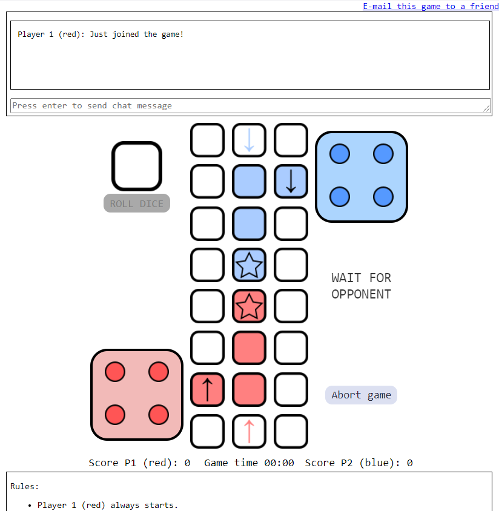

# WebSocket app: Ludo for 2 (lu2)
<ul>
<li>2 player online game assignment during my CS bachelor with express and node</li>
<li>You can check a live implementation at https://parchispara2.herokuapp.com/</li>
<li>If the player doesn't take any action the herokuapp environment will disconnect the player from the server after roughly 1 minute of inactivity.
That is a feature managed by herokuapp themselves. (A workaround could be to automatize an empty message from the client to the server every 30 seconds)</li>
<li>Local implementations do not have that feature.</li>
<li>Self-made graphics. Sounds downloaded from pachd.com (dice) and freesound.org (the rest).</li>
<li>Additional unused graphics provided, all my graphics are copyright free.</li>
</ul>
You can implement this game on your local machine. Install Node.js https://nodejs.org/en/ and git https://git-scm.com/. Then execute the following on the terminal:

```console
git clone https://github.com/skirienkopanea/lu2
cd lu2
npm install
npm start
```

You can now access the game at http://localhost:3000/ in the browser. Open another browser window on your local machine to access the game as another player. Other machines in your network may join by using the host local ip address.



Possible points of improvement:
<ul>
  <li>Change 'var' for let/const/''</li>
  <li>Add pairs of tokens of the same team blocking a cell feature</li>
  <li>Add buttons to toggle the chat/rules on/off.</li>
  <li>Improve the aesthetics of the game (place chat/rules on the sides, add a darkmode, make game mobile friendly by fitting the whole board to the entire page, etc.)</li>
 </ul>
